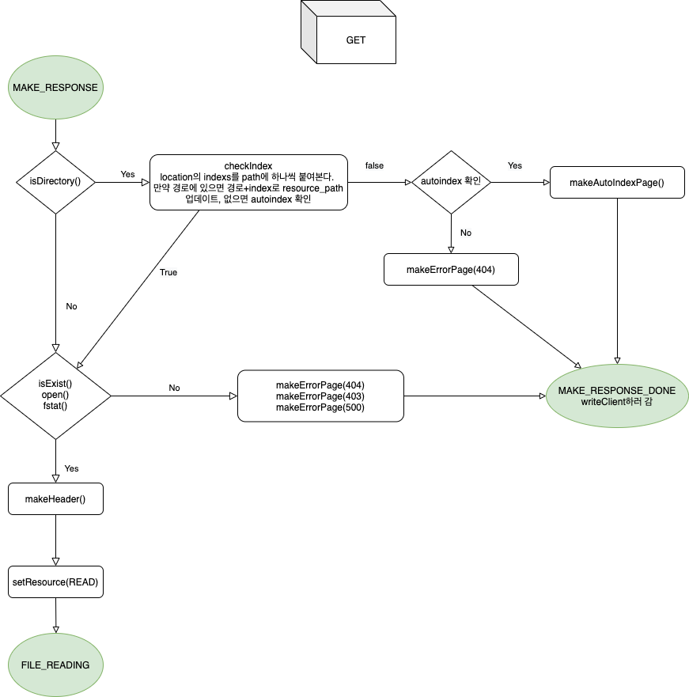
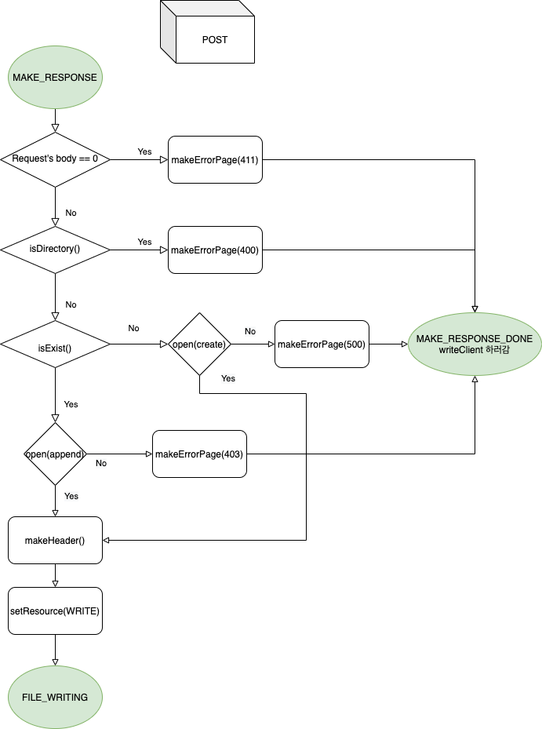
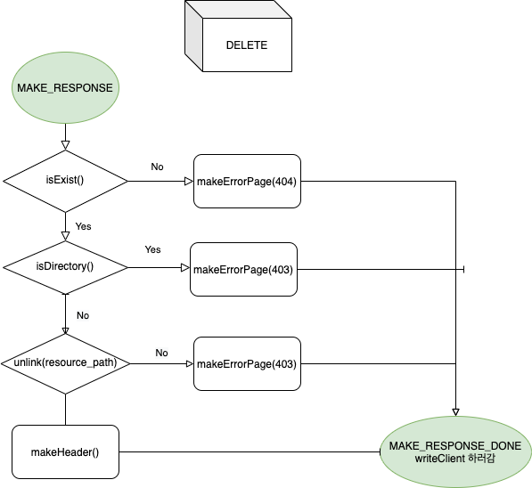
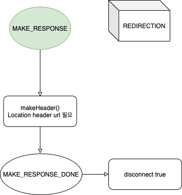
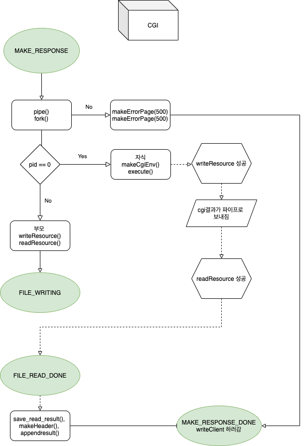

# webserv

webserv is a I/O Multiplexing HTTP/1.1 server. 

## Authors

* [selim](https://github.com/seohl16)
* [jiholee](https://github.com/zittoooo)
[노션 페이지](https://excited-kilogram-5f6.notion.site/2893d5376f1d4bdb98d8fddca3048dc8?v=3a0e8b56a903489fb4c82e2a21c7e5b7)

## 1. Build & Usage

```shell
# Compile the sources
make
```
```shell
# Run the server (if no 
./webserv [config_file]
```


## 2. Features 
- Nginx-like configuration file 
- HTTP Protocol (ex. status line, request line...)
- HTTP 1.1 Header
- I/O multiplexing (kqueue)
- GET, POST, DELETE HTTP methods 
- HTTP redirections 
- HTTP response status codes (ex. 200, 301...)
- CGI implementation (ex. bla, php...)
- Auto Index on/off


## 3. Configuration File Example

```
server
{
	server_name default
	listen 8180 127.0.0.1			

	location /					
	{
		error_page 404 ./tests/test1/error404.html
		allow_methods GET POST DELETE
		root ./tests/test1/
		index index.html index2.html
		auto_index on
		cgi_info .php ./tests/tester_bin/php-cgi
		cgi_info .bla ./tests/tester_bin/cgi_tester
	}
	
	location /auth/
	{
		allow_methods GET POST DELETE
		request_max_body_size	42
		root ./tests/test1/
		index index.html index2.html
		auto_index on
		cgi_info .php	./tests/tester_bin/php-cgi
		auth_key selim:1234
	}
}

```
- `server` : server block 
- `listen` : port and ip
- `location` : set for specific route
- `error_page` : path for custom error page 
- `allow_method` : allowed methods for HTTP requests
- `index` : default file for the requested URI
- `cgi_info` : cgi execute for specific file extension
- `request_max_body_size` : max limit for request body size
- `auth_key` : authorization needed

## 4. Test
- curl 
```
curl -X POST -H “Content-Type: plain/text” –data “BODY is here and write something longer or shorter than limit”
```
- Postman 

```
[POST] localhost:8179/index.html 
```


```
[GET/DELETE] localhost:8179/index
```


<!--  -->

<!--  -->

<!--  -->

- Browser 
```
localhost:8182
```

<!--  -->


```
localhost:8180/youpi.php
```


- Siege
```shell
# 소켓 제한을 풀어주는 명령어 
sudo sysctl -w net.inet.tcp.msl=100

# seige 명령어
siege -b -R <(echo connection = keep-alive) -c100 127.0.0.1:8180
```


<!--  -->

## 5. HTTP Method function explained with flowchart 

### 5.1. GET

<br>


### 5.2. POST

<br>


### 5.3. DELETE

<br>

### 5.4. REDIRECTION

<br>


### 5.5. CGI

<br>

